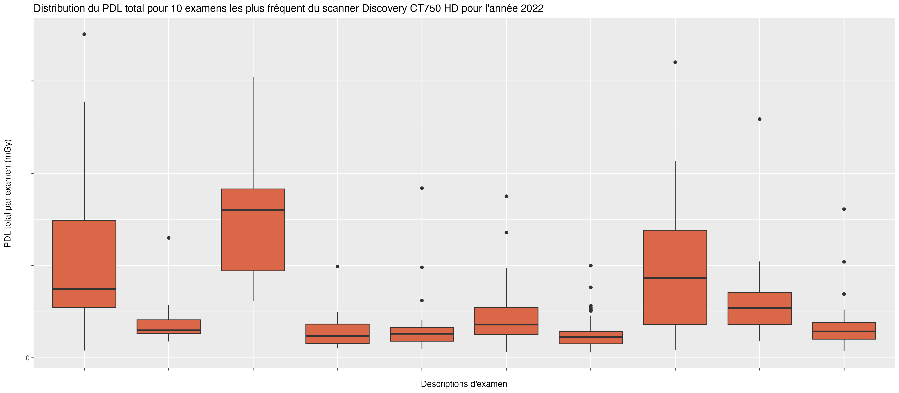

# CT_DRL

Script in R langage to extract data from DoseWatch Database to established DRL in computed tomography in regards with French law. The script generate also DRL statistics and boxplot on the major dose parameters.

You can download the project at this link even if it's recommended to clone or fork the repo :

# Prerequisite

Several R packages are mandatory but the script analyze your system and installs, if necessary, missing packages.

In your project root path you need to have one folder named "data" (and put your database export here) and another folder named "output" where the output files will be placed there.

**You have to export your database from DoseWatch for several GE CT units but for a unique year.** Then you will get to files : the general and the detailled excel file.

**Only GE scanners are supported for now** as each CT manufacturer labelized protocols in its own way.

**You have to convert in .csv the detailled .xlsx file.**

**Be careful the DRL files generation is only adapt for the french law format.**

# Adaptation to your workstation environment

You have to edit the following lines in order to run the script :

-   line 94 : edit the name of the .csv file to adapt with your own configuration,

- You have also to edit each line which detects Series.description name and adapt it to your own department labelizations.

# Test environment

This script have been tested in R 4.2.2 version in Rstudio v2022.12.0+353 in macOS Monterey version. But it should work on any OS system if your R program have the ability to work with additional R packages.

# Additional R packages list available from CRAN

| **Package** | **Version** | **Citation**                                    |
|---------------|---------------|------------------------------------------|
| base        | 4.2.2       | R Core Team (2022)                              |
| doMC        | 1.3.8       | Analytics and Weston (2022)                     |
| grateful    | 0.1.11      | Rodríguez-Sánchez, Jackson, and Hutchins (2022) |
| openxlsx    | 4.2.5.1     | Schauberger and Walker (2022)                   |
| rprojroot   | 2.0.3       | Müller (2022)                                   |
| tictoc      | 2.0.3       | Izrailev (2022)                                 |
| tidyverse   | 1.3.2       | Wickham et al. (2019)                           |

# Example of graphics output

In addition with DRL .csv file generation, the script help you to understand the patient exposure with several graphics output such as DLP, maxCTDIvol metrics. You can see for instance this one (values are masked for confidentiality reasons) :

# [Return to home page](https://fgardavaud.github.io/)

